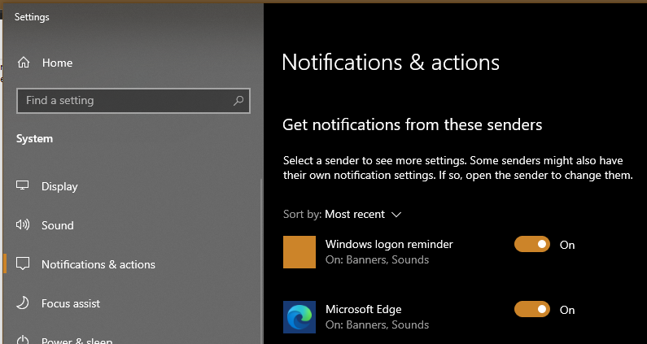
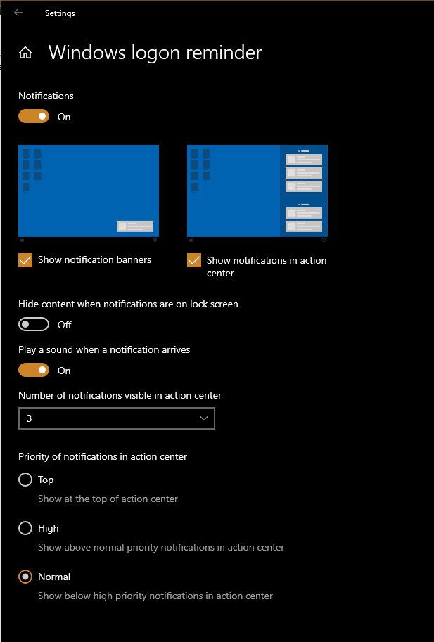

# The magic behind `wlrmdr.exe`

The tool is intended to display reminders from Winlogon (WinLogon ReMinDeRs). Such reminders may include scenarios like password expiration, additional credentials required etc. 
Two very special cases are related to the cloud passwords discussed below: one for the expiration, and one for change.

## Parameters 
Parameters to the `wlrmdr.exe` include:
- `-c` parameter effectively making nothing happen, except for -a=11
- `-s` somehow related to timeouts, but not very clear. It may be negative, except for -1, having a special meaning.
- `-f` flags defining icons, sound etc., as defined in the `dwInfoFlags` in the [`NOTIFYICONDATAW` structure documentation](https://docs.microsoft.com/en-us/windows/win32/api/shellapi/ns-shellapi-notifyicondataw). 
- `-t` title of the reminder. May contain spaces, does not have to be included in "".
- `-m` message within the popup. May contain spaces, does not have to be included in "".
- `-a` action, being a type of the reminder with special meaning for 8, 10, and 11 covered below.
- `-u` theoretically it contains URL to be passed to [`ShellExecute()`](https://docs.microsoft.com/en-us/windows/win32/api/shellapi/nf-shellapi-shellexecutew), and due to the nature of `ShellExecute()` may also contain document path, executable file etc. 

Order of parameters is important! Parameters `-s`, `-f`, `-t`, and `-m` must be present in the correct order, otherwise the command will silently fail.

Other parameters are totally ignored and do not affect the way how wlrmdr.exe works.

`Wlrmdr.exe` tries to identify its parent process, and when it is `winlogon.exe`, it changes the way how it works, but I was unable to follow this path any deeper so far. It's also related to the "-1" specified as a value for the `-s` parameter.

### Special cases
Special values for `-a` include:
- `8` - prompts for elevated credentials, but I was unable to identify the precise scenario.
- `10` - intended for cloud password change. Allows to specify `-u` parameter and requires click on notification before URL (or doc) is executed.
- `11` - intended for cloud password expiration. Allows to specify `-u` parameter and makes URL (or doc) executed without user interaction.

## Malicious scenarios
Practical usage scenarios may include the following steps:
1. Invoking URL for binaries. The behavior will depend on the internet browser, but by default it will download the file to `%userprofile%\Downloads` assigning the random name and `.crdownload` extension.
1. Invoking series of `cmd.exe /c` commands for identifying and renaming the downloaded binary to the desired name and extension.
1. Executing the downloaded file.

The nature of `ShellExecute()` will make the default browser to download the file. `Wlrmdr.exe` process does not download anything on its own.

Notifications from `wlrmdr.exe` may be managed through built-in settings app:

General Settings:

Windows Logon Reminders Settings:

## References
* https://github.com/gtworek/PSBits/blob/master/docs/wlrmdr.md

